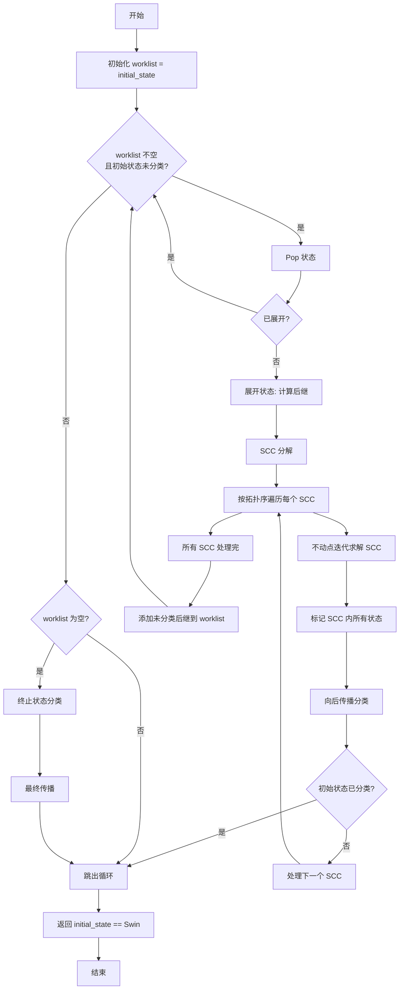

# On-The-Fly Synthesis 算法详解

> `is_realizable()` 核心循环的完整算法逻辑

---

## ⚠️ 重要说明

本文档记录了 **正确的算法理解**，之前的文档存在严重错误（见附录）。

---

## 1. 算法概述

### 1.1 什么是 On-The-Fly？

**传统算法** vs **On-The-Fly**：

| 方面 | 传统算法 | On-The-Fly 算法 |
|------|---------|-----------------|
| 图构建 | 预先构建完整游戏图 | 按需展开状态 |
| 内存 | 需要存储所有状态 | 只存储可达状态 |
| 效率 | 可能展开无用状态 | 只展开必要状态 |
| 适用场景 | 小规模公式 | 大规模公式 |

### 1.2 核心思想

```
┌─────────────────────────────────────────────────────────┐
│                  On-The-Fly 循环                        │
├─────────────────────────────────────────────────────────┤
│  while (有未处理状态 && 初始状态未分类) {                │
│                                                         │
│      1. EXPAND:   展开一个状态，计算后继                │
│                                                         │
│      2. SCC_DECOMPOSE: 对当前图做强连通分解             │
│                                                         │
│      3. SOLVE_SCC:  用不动点算法求解 SCC 内部状态       │
│                                                         │
│      4. PROPAGATE: 向后传播分类结果                     │
│                                                         │
│      5. ENQUEUE:   未分类的后继加入 worklist            │
│  }                                                      │
│                                                         │
│  return (初始状态 == Swin);                            │
└─────────────────────────────────────────────────────────┘
```

---

## 2. 基本概念

### 2.1 状态定义

| 状态类型 | 该谁移动 | 后继是什么 | 代码位置 |
|---------|---------|-----------|---------|
| **System** | System 选择输出 | Environment 状态（每个输出一个） | `on_the_fly_solver.cpp:237-238` |
| **Environment** | Environment 选择输入 | System 状态（每个输入一个，DFA 状态更新） | `on_the_fly_solver.cpp:259` |

### 2.2 状态转移链

```
System 状态 (选择输出)
    │
    ↓ output ∈ Outputs
    │
Environment 状态 (记录 System 选的输出)
    │
    ↓ input ∈ Inputs
    │
System 状态 (选择输出，DFA 状态更新)
    │
    ... 循环
```

---

## 3. SCC 的真正意义

### 3.1 为什么需要 SCC？

**问题**：状态分类存在循环依赖

```
q₀ 的胜负依赖 q₁
q₁ 的胜负依赖 q₂
q₂ 的胜负依赖 q₀  ← 循环依赖！
```

**解决**：SCC 分解得到拓扑序

```
SCC 之间形成 DAG（无环）：
    SCC_A → SCC_B → SCC_C

按拓扑序遍历：
    - 处理 SCC_A 时（它的后继 SCC 还没处理）
    - 处理 SCC_B 时（SCC_A 已处理）
    - 处理 SCC_C 时（SCC_A, SCC_B 已处理）

关键：处理某个 SCC 时，它的后继 SCC 都已经处理完了！
```

### 3.2 SCC 的作用

| 作用 | 说明 |
|------|------|
| **拓扑排序** | SCC 之间形成 DAG，可以按拓扑序处理 |
| **解决循环依赖** | 后继 SCC 先处理，保证后继状态已分类 |
| **隔离循环** | 唯一的循环依赖是 SCC **内部**状态之间 |

### 3.3 ❌ 错误理解

> **错误**："SCC 内所有状态具有相同胜负状态"
>
> **正确**：SCC 内状态需要分别判断，通过不动点迭代

---

## 4. SCC 内部的不动点算法

### 4.1 核心概念：完整的 sys+env 移动

**重要**：在 backward 算法中，"前驱关系"是指**一次完整的 sys move + env move**：

```
System 状态 s
    │ (sys move: 选择输出)
    ↓
Environment 状态 e
    │ (env move: 选择输入)
    ↓
System 状态 s'
```

只有 `s → e → s'` 才是一次完整的移动。`s` 是 `s'` 的前驱。

### 4.2 算法流程

```
┌─────────────────────────────────────────────────────────┐
│           SCC 内部状态分类（不动点迭代）                 │
├─────────────────────────────────────────────────────────┤
│                                                         │
│  Step 0: 构建 predecessors map                          │
│    - 遍历 scc 中每个 System 状态 s                      │
│    - 找 s 的 sys move 后继 e (env states)              │
│    - 找 e 的 env move 后继 s' (sys states)             │
│    - predecessors[s'].add(s)  // s → s' 完整移动        │
│    - 不排除 SCC 外的前驱                                │
│    - assert: s 和 s' 都是 System 状态                   │
│                                                         │
│  Step 1: 初始化种子集合 (swin_states):                  │
│    - swin_states 只包含 System 状态                    │
│    - 当前 SCC 中所有 esa 的 System 状态                │
│    - 加上 predecessors map keys 中已标记为 Swin 的状态  │
│                                                         │
│  Step 2: 不动点迭代：                                    │
│    while (有新 Swin 产生) {                            │
│                                                         │
│        tmpSet = 空集                                    │
│        assert: tmpSet 只包含 System 状态               │
│                                                         │
│        // 从 swin_states 出发找所有前驱                │
│        for each swin in swin_states:                   │
│            for each pred in predecessors[swin]:        │
│                if pred 未分类:                          │
│                    tmpSet.add(pred)                     │
│                                                         │
│        // 遍历 tmpSet 进行分类                          │
│        new_swin = 空集                                  │
│        for each s in tmpSet:                            │
│            // 检查是否存在安全的 sys move               │
│            if (EXISTS sys move such that               │
│                ALL env moves from that sys state       │
│                lead to Swin):                          │
│                s = Swin                                 │
│                new_swin.add(s)                          │
│                                                         │
│        if new_swin 为空:                                │
│            终止循环                                     │
│        else:                                            │
│            swin_states = swin_states ∪ new_swin        │
│    }                                                    │
│                                                         │
│  Step 3: 剩余状态标记为 Ewin                            │
│    未被标记为 Swin 的状态 → 全部标记为 Ewin            │
│                                                         │
└─────────────────────────────────────────────────────────┘
```

### 4.3 为什么这样设计？

**关键改变**：
1. **predecessors 不限制在 SCC 内**：因为 SCC 外的已分类状态可以提供胜负信息
2. **swin_states 只包含 System 状态**：只有 System 状态进行 sys move
3. **基于完整移动的传播**：只考虑完整 sys+env 移动的前驱关系
4. **分类条件**：存在一个 sys move，使得该 move 后的所有 env moves 都通向 Swin

**直觉**：
- System 选择输出后，Environment 会选择最不利的输入
- 如果存在一个输出，使得无论 Environment 选什么输入都通向 Swin，则 System 有必胜策略
- Swin 通过完整移动向前传播到前驱 System 状态

### 4.4 伪代码

```cpp
void classify_scc(const vector<GameState>& scc) {
    // ========== Step 0: 构建 predecessors map ==========
    // key: System 状态（即将进行 sys move）
    // value: 能通过完整 sys+env 移动到达 key 的前驱 System 状态集合
    unordered_map<GameState, unordered_set<GameState>> predecessors;

    for (const auto& s : scc) {
        if (s.player != Player::System) continue;  // 只处理 System 状态

        // 第一重：sys move → env states
        auto succ_it = successors_.find(s);
        if (succ_it == successors_.end()) continue;

        for (const auto& e : succ_it->second) {
            // 第二重：env move → sys states
            auto env_succ_it = successors_.find(e);
            if (env_succ_it == successors_.end()) continue;

            for (const auto& s_prime : env_succ_it->second) {
                assert(s_prime.player == Player::System);  // 断言：s' 是 System 状态
                predecessors[s_prime].insert(s);
            }
        }
    }

    // ========== Step 1: 初始化种子集合 ==========
    // swin_states 只包含 System 状态
    unordered_set<GameState> swin_states;

    // 当前 SCC 中所有 esa 的 System 状态
    for (const auto& s : scc) {
        if (classification_.count(s)) {
            if (classification_[s] == StateClass::Swin && s.player == Player::System) {
                swin_states.insert(s);
            }
            continue;
        }

        if (is_empty_string_accepting(s.dfa_state)) {
            if (s.player == Player::System) {
                swin_states.insert(s);
                classification_[s] = StateClass::Swin;
            } else {
                // Environment 状态被分类但不加入 swin_states
                classification_[s] = StateClass::Swin;
            }
        }
    }

    // predecessors map keys 中已标记为 Swin 的状态
    for (const auto& pair : predecessors) {
        const GameState& key = pair.first;
        assert(key.player == Player::System);  // 断言：key 是 System 状态
        auto cls_it = classification_.find(key);
        if (cls_it != classification_.end() && cls_it->second == StateClass::Swin) {
            swin_states.insert(key);
        }
    }

    // ========== Step 2: 不动点迭代 ==========
    bool changed = true;
    while (changed) {
        changed = false;
        unordered_set<GameState> new_swin_states;

        // 2a. 从 swin_states 出发找所有前驱 → tmpSet
        unordered_set<GameState> tmpSet;
        for (const GameState& swin : swin_states) {
            assert(swin.player == Player::System);  // 断言：swin 是 System 状态

            auto pred_it = predecessors.find(swin);
            if (pred_it == predecessors.end()) continue;

            for (const GameState& pred : pred_it->second) {
                assert(pred.player == Player::System);  // 断言：pred 是 System 状态
                if (!classification_.count(pred)) {
                    tmpSet.insert(pred);
                }
            }
        }

        // 2b. 遍历 tmpSet 进行分类
        for (const GameState& s : tmpSet) {
            assert(s.player == Player::System);  // 断言：s 是 System 状态
            if (classification_.count(s)) continue;

            auto succ_it = successors_.find(s);
            if (succ_it == successors_.end()) continue;

            // 检查是否存在一个 sys move，使得所有后续 env moves 都通向 Swin
            bool has_safe_sys_move = false;
            for (const auto& e : succ_it->second) {  // sys move → env states
                // 对于这个 env state，检查所有 env moves 是否都通向 Swin
                bool all_env_moves_swin = true;
                auto env_succ_it = successors_.find(e);
                if (env_succ_it == successors_.end()) {
                    all_env_moves_swin = false;
                } else {
                    for (const auto& s_prime : env_succ_it->second) {
                        auto cls_it = classification_.find(s_prime);
                        if (cls_it == classification_.end() ||
                            cls_it->second != StateClass::Swin) {
                            all_env_moves_swin = false;
                            break;
                        }
                    }
                }

                if (all_env_moves_swin) {
                    has_safe_sys_move = true;
                    break;
                }
            }

            if (has_safe_sys_move) {
                classification_[s] = StateClass::Swin;
                new_swin_states.insert(s);
                changed = true;
            }
        }

        swin_states.insert(new_swin_states.begin(), new_swin_states.end());
    }

    // ========== Step 3: 剩余状态标记为 Ewin ==========
    for (const auto& s : scc) {
        if (!classification_.count(s)) {
            classification_[s] = StateClass::Ewin;
        }
    }
}
```

### 4.5 与旧算法的区别

| 方面 | 旧算法 | 新算法 |
|------|--------|--------|
| predecessors 构建 | 只在 SCC 内，单层边 | 不限制，两层（sys+env） |
| predecessors 方向 | succ → pred（任意类型） | System → System（完整移动） |
| seed set | SCC 内 esa 状态 | 只包含 System 状态的 esa |
| 传播方向 | 任意状态间传播 | 只在 System 状态间传播 |
| 检查条件 | 基于 player 类型（ANY/ALL） | 检查完整移动中 env moves 是否都通向 Swin |

### 4.6 示例：E1 为什么应该是 Swin

```
游戏图：
    S0 (System) --sys={p}--> E1 (Environment) --env={}--> S1 (System, Swin)

旧算法问题：
    - E1 是单节点 SCC（Environment），没有内部前驱
    - 无法传播 Swin
    - 最终标记为 Ewin ❌

新算法：
    - Step 0: predecessors[S1] = {S0}  (S0 → E1 → S1)
    - Step 1: swin_states 包含 S1（已标记，System 状态）
    - Step 2: 从 S1 找前驱 → S0
    - 检查 S0 的 sys move {p}:
      - E1 的 env move {} → S1 (Swin)
      - 所有 env moves 通向 Swin ✓
    - S0 标记为 Swin ✅
    - E1 作为 Environment 状态在 Step 3 中根据其他条件分类
```

---

## 5. 正确的传播规则

### 5.1 核心逻辑

| 当前状态 | 条件 | 结果 | 直觉 |
|---------|------|------|------|
| **System** | **任一**后继是 Swin | Swin | System 可以选择输出到达 Swin 状态 |
| **System** | **所有**后继是 Ewin | Ewin | System 无论选什么都到 Ewin |
| **Environment** | **所有**后继是 Swin | Swin | Environment 无法避免 Swin |
| **Environment** | **任一**后继是 Ewin | Ewin | Environment 会选到达 Ewin 的输入 |

### 5.2 直觉解释

**System 状态**（System 有主动权）：
- System **想要** Swin，会**选择**有利输出
- 只要**有一个**选择能到 Swin → System 选它 → Swin
- 只有**所有**选择都到 Ewin → System 没法避免 → Ewin

**Environment 状态**（Environment 有主动权，但和 System 对抗）：
- Environment **想要** Ewin，会**选择**对 System 不利的输入
- 只要**有一个**选择能到 Ewin → Environment 选它 → Ewin
- 只有**所有**选择都只能到 Swin → Environment 没法避免 → Swin

### 5.3 ⚠️ 代码中的 BUG

当前代码 `on_the_fly_solver.cpp:442-449` 的 Environment 传播规则是**反的**：

```cpp
// ❌ 错误代码
if (all_ewin && !succs.empty()) {
    classification_[state] = StateClass::Ewin;  // 错误！
} else if (has_swin) {
    classification_[state] = StateClass::Swin;  // 错误！
}

// ✅ 正确逻辑
if (has_ewin) {           // 任一后继是 Ewin
    classification_[state] = StateClass::Ewin;
} else if (all_swin) {    // 所有后继是 Swin
    classification_[state] = StateClass::Swin;
}
```

详见：`docs/BUGS/open.md` [BUG-002]

---

## 6. 循环条件分析

### 6.1 代码

```cpp
while (!worklist_.empty() && !is_initial_classified()) {
    // ...
}
```

### 6.2 条件解析

| 条件 | 含义 | 何时为真 |
|------|------|---------|
| `!worklist_.empty()` | 还有待处理的状态 | worklist 中存在未展开状态 |
| `!is_initial_classified()` | 初始状态未确定胜负 | classification_ 中没有初始状态 |

### 6.3 退出情况

```cpp
// 情况 1: 初始状态被分类 → 可以判定 realizability
if (is_initial_classified()) {
    return (classification_[initial_state_] == StateClass::Swin);
}

// 情况 2: worklist 为空 → 需要检查是否已穷尽所有可达状态
if (worklist_.empty()) {
    // 进入 terminal classification 逻辑
}
```

---

## 7. 循环体五阶段详解

### 7.1 阶段 1: EXPAND（展开状态）

```cpp
// Pop a state to expand
GameState state = worklist_.back();
worklist_.pop_back();

// Skip if already expanded
if (expanded_.count(state)) {
    continue;
}

// Expand state (compute successors)
expand_state(state);
```

**目的**：计算一个状态的所有后继状态

**状态展开规则**：
```cpp
if (state.player == Player::System) {
    // System 回合：枚举所有输出赋值
    for (const auto& out : outputs) {
        succs.push_back(environment_state(state.dfa_state, out));
    }
} else {
    // Environment 回合：枚举所有输入赋值
    for (const auto& in : inputs) {
        automata::Assignment full = state.system_chosen_output.value();
        // 添加输入变量
        for (int v : in) {
            full.insert(v + output_gen_.num_variables());
        }
        automata::TableauState* next_dfa = dfa_.successor(state.dfa_state, full);
        succs.push_back(system_state(next_dfa));
    }
}
```

---

### 7.2 阶段 2: SCC_DECOMPOSE（强连通分解）

```cpp
// Run SCC decomposition on current graph
auto sccs = find_sccs();
```

**目的**：识别游戏图中的强连通分量（循环）

**算法**：Tarjan's SCC Algorithm

**复杂度**：O(V + E)，其中 V = 已展开状态数，E = 边数

**结果**：返回 SCC 列表，SCC 之间有拓扑序

---

### 7.3 阶段 3: SOLVE_SCC（求解 SCC）

**⚠️ 当前代码实现不正确**

正确的做法应该是使用不动点迭代（见第 4 节），但当前代码简化为：

```cpp
// 当前代码（简化版，可能不正确）
auto cls = try_classify_scc(scc);
if (cls) {
    // 标记整个 SCC
    for (const auto& s : scc) {
        classification_[s] = *cls;
    }
}
```

**问题**：
1. "SCC 包含接受状态 → 整个 SCC 是 Swin" 是错误的
2. 应该用不动点迭代，分别判断每个状态

---

### 7.4 阶段 4: PROPAGATE（向后传播）

```cpp
bool initial_done = propagate_classification();
if (initial_done) {
    LOG_DEBUG("OnTheFlyGameSolver: initial state classified!");
    break;
}
```

**目的**：将 SCC 内分类的结果传播到 SCC 外的前驱

**传播方向**：从后继向前驱（backward propagation）

**迭代至不动点**：重复传播直到没有新分类产生

---

### 7.5 阶段 5: ENQUEUE（加入未分类后继）

```cpp
// Add unclassified successors to worklist
for (const auto& pair : successors_) {
    for (const GameState& succ : pair.second) {
        if (!classification_.count(succ) && !expanded_.count(succ)) {
            worklist_.push_back(succ);
        }
    }
}
```

**条件**：状态既未分类也未展开

**目的**：逐步探索整个可达状态空间

---

## 8. 算法流程图



---

## 9. 复杂度分析

| 阶段 | 单次复杂度 | 总复杂度 |
|------|-----------|---------|
| Expand | O(2^m × 2^n) | O(V × 2^m × 2^n) |
| SCC Decompose | O(V + E) | O(V × (V + E)) |
| Solve SCC (不动点) | O(\|SCC\| × deg) | O(V × E) |
| Propagate | O(V + E) | O(V × (V + E)) |

其中：
- V = 已展开状态数
- E = 边数
- m = 输出变量数
- n = 输入变量数
- deg = 平均度数

**On-the-Fly 优势**：V 可能远小于完整游戏图的状态数

---

## 10. 附录：之前的错误理解

### 10.1 错误 1: SCC 内所有状态相同胜负

> ❌ **错误**："同一 SCC 内的所有状态具有相同的胜负状态"
>
> ✅ **正确**：SCC 内状态需要分别判断，通过不动点迭代

### 10.2 错误 2: 接受状态 SCC 都是 Swin

> ❌ **错误**："SCC 包含接受状态 → 整个 SCC 都是 Swin"
>
> ✅ **正确**：接受状态是 Swin 的种子，需要通过不动点迭代传播

### 10.3 错误 3: 传播规则搞反

> ❌ **错误**：Environment 状态"所有后继 Ewin → Ewin"
>
> ✅ **正确**：Environment 状态"任一后继 Ewin → Ewin"

---

## 11. 真正的 On-The-Fly 优化策略

### 11.1 当前实现的问题

**当前 expand_state 不是真正的 on-the-fly**：

```cpp
// 当前代码：全量展开
auto outputs = output_gen_.all_assignments();  // 枚举所有 2^m 个输出

for (const auto& out : outputs) {  // 全部展开
    succs.push_back(environment_state(state.dfa_state, out));
}
```

| 方面 | 当前实现 | 真正 on-the-fly |
|------|---------|----------------|
| 展开 | 每个状态完全展开所有后继 | 按需展开后继 |
| 内存 | 存储所有后继 | 只存储必要后继 |
| 复杂度 | O(V × 2^m × 2^n) | 与可达状态相关，不与所有赋值相关 |

### 11.2 On-The-Fly 优化策略

#### 策略 1：逐步展开

```
当前：一次性展开所有后继
    sys_move → {env1, env2, env3, ...}  (全部展开)

优化：一次只展开一个
    sys_move → env1 → ...  (只展开这一条路径)
              ↓
           如果 env1 确定了结果，再考虑 env2
```

#### 策略 2：sys-move 的早期终止（Swin）

```
sys 状态选择输出：
    尝试 output1 → env 状态 → ... → 发现是 Swin
    → 直接判定：当前 sys 状态是 Swin
    → 无需尝试其他 output
```

#### 策略 3：sys-move 的剪枝（Ewin）

```
sys 状态选择输出：
    尝试 output1 → env 状态 → ... → 发现是 Ewin
    → 当前 output 不可行，尝试下一个 output
    → 如果所有 output 都导致 Ewin → 当前 sys 状态是 Ewin
```

#### 策略 4：env-move 的剪枝（回退）

```
env 状态选择输入：
    尝试 input1 → sys 状态 → ... → 发现是 Ewin
    → Environment 找到让 System 输的输入！
    → 无需尝试其他 input
    → 直接回退到上一个 sys 状态，尝试下一个 output
```

### 11.3 算法流程（深度优先 + 剪枝）

```
function solve(sys_state):
    for each output in outputs:
        env_state = environment_state(sys_state, output)

        // 检查 env 状态
        result = check_env(env_state)

        if result == Swin:
            // 找到一个能赢的输出
            return Swin

        // result == Ewin，当前 output 不可行
        // 继续尝试下一个 output

    // 所有 output 都导致 Ewin
    return Ewin

function check_env(env_state):
    for each input in inputs:
        next_sys = system_state(env_state, input)

        result = solve(next_sys)

        if result == Ewin:
            // Environment 找到让 System 输的输入！
            // 无需尝试其他 input，直接返回
            return Ewin

    // 所有 input 都导致 Swin
    return Swin
```

### 11.4 剪枝效果

| 场景 | 无剪枝 | 有剪枝 |
|------|-------|-------|
| sys 找到 Swin 输出 | 遍历所有 output | 只遍历到第一个 |
| env 找到 Ewin 输入 | 遍历所有 input | 只遍历到第一个 |
| 最坏情况 | 遍历所有 | 遍历所有 |
| 平均情况 | 大量冗余探索 | 显著减少探索 |

### 11.5 实现要点

1. **深度优先搜索**：一条路径走到底，而不是广度优先展开所有后继
2. **提前返回**：sys-move 找到 Swin → 立即返回
3. **env 剪枝**：env-move 找到 Ewin → 立即返回，不试其他 input
4. **记忆化**：已分类状态缓存，避免重复计算

---

## 12. 相关文件

| 文件 | 说明 |
|------|------|
| `include/synthesis/on_the_fly_solver.hpp` | OnTheFlyGameSolver 类定义 |
| `src/synthesis/on_the_fly_solver.cpp` | 算法实现 |
| `docs/ARCHITECTURE/synthesis.md` | Synthesis 模块架构 |
| `docs/ARCHITECTURE/components.md` | 核心组件设计 |
| `docs/BUGS/open.md` | 已知 Bug 列表 |
