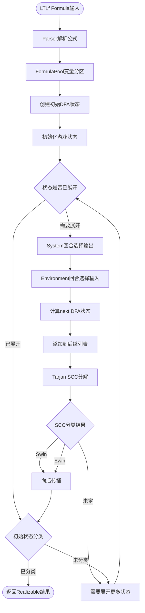

# LTLf Synthesis 架构详解

> CosyZeroRewrite 项目中 Synthesis 模块的完整架构

**最后更新**: 2026-01-02

---

## 目录

1. [核心概念](#核心概念)
2. [Synthesis 架构](#synthesis-架构)
3. [两个实现版本对比](#两个实现版本对比)
4. [算法流程图](#算法流程图)
5. [输入输出分离](#输入输出分离)
6. [关键类关系](#关键类关系)
   - [类依赖概览](#类依赖概览)
   - [完整数据流程图](#完整数据流程图)
   - [为什么每一部分都是必需的](#为什么每一部分都是必需的)
   - [数据流转示例](#数据流转示例)
   - [各类的职责总结](#各类的职责总结)

---

## 核心概念

### 什么是 LTLf Synthesis？

**问题**: 给定一个 LTLf 公式 φ，系统是否总能选择输出值使得 φ 成立（无论环境如何选择输入）？

**双人博弈**:
- **System (系统)**: 控制输出变量
- **Environment (环境)**: 控制输入变量
- **目标**: 系统需要找到**对抗所有环境选择**的获胜策略

```
           ┌─────────────────┐
           │   Synthesis     │
           │   Problem       │
           └────────┬────────┘
                    │
        ┌───────────┴───────────┐
        │                       │
   ┌────▼────┐            ┌─────▼────┐
   │ System  │            │Environment│
   │ Outputs │            │  Inputs  │
   └────┬────┘            └─────┬────┘
        │                       │
        │   系统选择输出  →  环境选择输入  →  循环...
        │
    谁有必胜策略？
```

### 语义层次

| 层次 | 说明 | 示例 |
|------|------|------|
| LTLf Formula | 用户编写的时序逻辑公式 | `G (req → F ack)` |
| NNF | 否定范式（否定只出现在原子命题前） | `G (!req ∨ F ack)` |
| Tableau DFA | 从公式构造的自动机 | 状态 + 转移 |
| Game Graph | 扩展了玩家信息的游戏图 | (DFA状态, 玩家, 赋值) |

---

## Synthesis 架构

### 整体架构图

```
┌─────────────────────────────────────────────────────────────────────┐
│                        LTLf Synthesis System                       │
├─────────────────────────────────────────────────────────────────────┤
│                                                                     │
│  用户输入                                                            │
│  ┌────────────────┐    ┌────────────────┐                         │
│  │ Formula:       │    │ Partition:     │                         │
│  │ "G(req→F ack)" │    │ .outputs: ack  │                         │
│  │                │    │ .inputs:  req  │                         │
│  └────────┬───────┘    └────────┬───────┘                         │
│           │                     │                                  │
│           └──────────┬──────────┘                                  │
│                      ▼                                             │
│           ┌──────────────────────┐                                  │
│           │  FormulaParser       │                                  │
│           │  (解析 + 变量声明)     │                                  │
│           └──────────┬───────────┘                                  │
│                      ▼                                             │
│           ┌──────────────────────┐                                  │
│           │  FormulaPool         │                                  │
│           │  (Hash Consing 存储)  │                                  │
│           └──────────┬───────────┘                                  │
│                      │                                             │
│      ┌───────────────┼───────────────┐                              │
│      ▼               ▼               ▼                              │
│ ┌──────────┐  ┌──────────┐  ┌──────────────────┐                      │
│ │ DFABuilder│  │OnTheFly  │  │  TableauState    │                      │
│ │          │  │GameSolver│  │  + OnTheFlyDFA   │                      │
│ └─────┬────┘  └─────┬────┘  └──────────────────┘                      │
│       │             │                                              │
│       │             │  ←【当前主要使用】                              │
│       ▼             ▼                                              │
│  ┌──────────────────────────────────────┐                            │
│  │       SCC Decomposition (Tarjan)    │                            │
│  └───────────────┬──────────────────────┘                            │
│                  ▼                                                   │
│  ┌──────────────────────────────────────┐                            │
│  │    State Classification (Swin/Ewin) │                            │
│  └───────────────┬──────────────────────┘                            │
│                  ▼                                                   │
│  ┌──────────────────────────────────────┐                            │
│  │     Backward Propagation            │                            │
│  └───────────────┬──────────────────────┘                            │
│                  ▼                                                   │
│           ┌─────────────┐                                           │
│           │ Realizable? │                                           │
│           │   YES / NO   │                                           │
│           └─────────────┘                                           │
│                                                                     │
└─────────────────────────────────────────────────────────────────────┘
```

---

## 两个实现版本对比

### 版本概览

| 特性 | DFABuilder 版本 | OnTheFlyGameSolver 版本 |
|------|----------------|------------------------|
| **文件位置** | `src/automata/dfa.cpp` | `src/synthesis/on_the_fly_solver.cpp` |
| **状态表示** | `StateFormulaSet` | `GameState = (TableauState*, Player, Assignment)` |
| **DFA构造** | 完整构造 | 按需构造 |
| **玩家区分** | ❌ 无 | ✅ 明确区分 System/Environment |
| **内存使用** | 较高（全量构造） | 较低（懒加载） |
| **当前状态** | 基础实现完成 | 主要实现，持续优化中 |
| **调用入口** | `GameSolver::is_realizable()` | `is_realizable_on_the_fly()` ← Cosy2主入口 |

### DFABuilder 版本 (静态 DFA 构造)

**核心思想**: 先构造完整 DFA，再进行游戏求解

```
输入公式 φ
    │
    ▼
┌──────────────────────────┐
│ 1. 转换为 XNF            │
│    (Next 范式)            │
└──────────┬───────────────┘
           │
           ▼
┌──────────────────────────┐
│ 2. 提取原子命题          │
│    primitives = {p, Xp}   │
└──────────┬───────────────┘
           │
           ▼
┌──────────────────────────┐
│ 3. 生成所有 MCS          │
│    (Maximal Consistent   │
│     Sets) 作为状态        │
└──────────┬───────────────┘
           │
           ▼
┌──────────────────────────┐
│ 4. 构造转移              │
│    基于 X-公式            │
└──────────┬───────────────┘
           │
           ▼
┌──────────────────────────┐
│ 5. 标记接受状态          │
│    is_accepting_state()  │
└──────────┬───────────────┘
           │
           ▼
      完整 DFA
```

**问题**: 没有区分输入/输出，不适合 synthesis

### OnTheFlyGameSolver 版本 (动态游戏求解)

**核心思想**: 边构造游戏图边求解，明确区分玩家

```
输入公式 φ + FormulaPool (带变量分区)
    │
    ▼
┌──────────────────────────────────┐
│ 1. 创建 OnTheFlyDFA              │
│    initial_state = {φ及其子公式}  │
└──────────┬───────────────────────┘
           │
           ▼
┌──────────────────────────────────┐
│ 2. 初始化游戏状态                │
│    (DFA初始态, System回合)         │
└──────────┬───────────────────────┘
           │
           ▼
┌──────────────────────────────────┐
│ 3. 循环: 展开状态               │
│    a) 系统回合: 生成所有输出赋值  │
│    b) 环境回合: 生成所有输入赋值  │
│    c) 计算 next DFA state        │
└──────────┬───────────────────────┘
           │
           ▼
┌──────────────────────────────────┐
│ 4. SCC 分解 (Tarjan)             │
│    检测循环                       │
└──────────┬───────────────────────┘
           │
           ▼
┌──────────────────────────────────┐
│ 5. SCC 分类                      │
│    • SCC包含接受状态 → Swin      │
│    • SCC所有后继是Swin → Swin     │
│    • 否则 → Ewin 或继续          │
└──────────┬───────────────────────┘
           │
           ▼
┌──────────────────────────────────┐
│ 6. 向后传播分类                  │
│    System: 任意后继Swin → Swin  │
│    Environment: 所有后继Swin → Swin│
└──────────┬───────────────────────┘
           │
           ▼
    初始状态分类 = 答案
```

---

## 算法流程图

### 详细流程图 (Mermaid 可视化)



### 数据结构关系图

```
┌─────────────────────────────────────────────────────────────┐
│                     FormulaPool                            │
│  ┌─────────────────────────────────────────────────────┐   │
│  │ variables_: outputs + inputs                          │   │
│  │   num_outputs_ = 2  (p0, p1)                        │   │
│  │   num_inputs_  = 1  (p2)                            │   │
│  └─────────────────────────────────────────────────────┘   │
│  ┌─────────────────────────────────────────────────────┐   │
│  │ pool_: Hash Set of Formula*                        │   │
│  │   ¬(X(G(p5))) = !X(G(p5))                          │   │
│  └─────────────────────────────────────────────────────┘   │
└─────────────────────────────────────────────────────────────┘
                            │
                            │ create/parse
                            ▼
┌─────────────────────────────────────────────────────────────┐
│                    TableauState                             │
│  formulas_: FormulaSet = {f1, f2, ...}                    │
│    e.g., {¬(X(G(p5))), X(p6), true, ...}                  │
│                                                             │
│  is_accepting():                                           │
│    - 无 false                                               │
│    - 局部一致                                               │
│    - Until右式满足                                          │
└─────────────────────────────────────────────────────────────┘
                            │
                            │ DFA状态
                            ▼
┌─────────────────────────────────────────────────────────────┐
│                      GameState                               │
│  dfa_state: TableauState*                                  │
│  player: System | Environment                              │
│  system_chosen_output: Assignment (仅Environment回合有值)           │
│                                                             │
│  successors: vector<GameState>                             │
│    System回合: 后继是所有可能的 (环境选择输入后的DFA状态)     │
│    Environment回合: 后继是所有可能的 (系统选择输出后的环境状态) │
└─────────────────────────────────────────────────────────────┘
```

---

## 输入输出分离

### 变量分区 (Variable Partitioning)

```
所有变量 = outputs ∪ inputs

.outputs: p0, p1  ← System 控制
.inputs:  p2, p3  ← Environment 控制
```

### 编号规则

```cpp
// FormulaPool 中的编号
outputs:  id = 0, 1, ..., num_outputs-1
inputs:   id = num_outputs, ..., num_outputs+num_inputs-1

// 判断变量类型
if (var_id < num_outputs) {
    // 这是输出，系统可以控制
} else {
    // 这是输入，环境控制
}
```

### 游戏展开中的赋值

```
System 回合:
  outputs_gen 生成所有输出赋值 (2^num_outputs 种)
  每种赋值 → Environment状态

Environment 回合:
  inputs_gen 生成所有输入赋值 (2^num_inputs 种)
  合并 system_chosen_output + input → full_assignment
  full_assignment → next DFA state
```

---

## 关键类关系

### 类依赖概览

```cpp
// 核心关系
FormulaPool
    ├── Formula* (存储所有公式)
    └── num_outputs_, num_inputs_ (变量分区信息)

TableauState
    ├── FormulaSet formulas_ (状态中的公式集合)
    └── is_accepting() (接受状态判定)

OnTheFlyDFA
    ├── TableauStatePool state_pool_ (状态池)
    ├── FormulaPool& pool_ (公式池引用)
    ├── int num_outputs_ (输出数量，用于synthesis检查)
    └── is_accepting(TableauState*) → bool (synthesis语义的接受判定)

OnTheFlyGameSolver
    ├── OnTheFlyDFA dfa_ (DFA)
    ├── AssignmentGenerator output_gen_ (输出生成器)
    ├── AssignmentGenerator input_gen_ (输入生成器)
    ├── classification_ (状态分类: Swin/Ewin/Unknown)
    └── successors_ (后继关系)
```

### 完整数据流程图

```
┌─────────────────────────────────────────────────────────────────────────┐
│                         LTLf Synthesis 完整流程                          │
└─────────────────────────────────────────────────────────────────────────┘

    用户输入
       │
       ▼
┌─────────────────────────────────────────────────────────────────────────┐
│  FormulaPool                                                            │
│  ┌──────────────────────────────────────────────────────────────────┐  │
│  │ 职责: 1. 解析公式字符串  2. Hash Consing 去重  3. 记录变量分区    │  │
│  │                                                                 │  │
│  │  "G(req → F ack)" ──解析──→ Formula* (树结构)                     │  │
│  │                            │                                      │  │
│  │                            ├─→ num_outputs_ = 1  (ack)           │  │
│  │                            └─→ num_inputs_  = 1  (req)           │  │
│  └──────────────────────────────────────────────────────────────────┘  │
│                              │                                          │
│                              │ 创建初始状态                              │
│                              ▼                                          │
└─────────────────────────────────────────────────────────────────────────┘
                             │
                             ▼
┌─────────────────────────────────────────────────────────────────────────┐
│  TableauState                                                           │
│  ┌──────────────────────────────────────────────────────────────────┐  │
│  │ 职责: 表示 DFA 状态，存储一组公式                                  │  │
│  │                                                                 │  │
│  │  State_0: {G(req → F ack)}         ← 初始状态                      │  │
│  │  State_1: {!req ∨ F ack, G(req → F ack)}  ← 展开 Next 后           │  │
│  │  State_2: {F ack, req → F ack, ...}      ← 直到满足 Until         │  │
│  └──────────────────────────────────────────────────────────────────┘  │
│                              │                                          │
│                              │ 需要判断状态是否接受                      │
│                              ▼                                          │
└─────────────────────────────────────────────────────────────────────────┘
                             │
                             ▼
┌─────────────────────────────────────────────────────────────────────────┐
│  OnTheFlyDFA                                                            │
│  ┌──────────────────────────────────────────────────────────────────┐  │
│  │ 职责: 1. 计算 DFA 转移  2. Synthesis 语义的接受判定               │  │
│  │                                                                 │  │
│  │  successor(State, Assignment) → NextState                         │  │
│  │  is_accepting(State) → bool   ← 关键：区分 input/output           │  │
│  │                                                                 │  │
│  │  示例: State 包含 {req} 时，                                         │
│  │        if req 是 input → 返回 false (System 无法保证)              │  │
│  └──────────────────────────────────────────────────────────────────┘  │
│                              │                                          │
│                              │ 提供游戏状态展开所需                      │
│                              ▼                                          │
└─────────────────────────────────────────────────────────────────────────┘
                             │
                             ▼
┌─────────────────────────────────────────────────────────────────────────┐
│  OnTheFlyGameSolver                                                     │
│  ┌──────────────────────────────────────────────────────────────────┐  │
│  │ 职责: 1. 展开 2-玩家游戏图  2. SCC 分解  3. 状态分类  4. 向后传播 │  │
│  │                                                                 │  │
│  │  GameState = (TableauState*, Player, Assignment)                  │  │
│  │                                                                 │  │
│  │  展开过程:                                                        │  │
│  │    (State, System)    → 生成所有输出 → (State', Environment)     │  │
│  │    (State', Env)      → 生成所有输入 → (State'', System)         │  │
│  │                                                                 │  │
│  │  判断初始状态是否为 Swin = Realizable?                            │  │
│  └──────────────────────────────────────────────────────────────────┘  │
└─────────────────────────────────────────────────────────────────────────┘
```

### 为什么每一部分都是必需的

#### FormulaPool - 内存管理和公式去重

**为什么需要**：
- LTLf 公式展开会产生大量**结构重复**的子公式
- Hash Consing 技术：相同结构的公式只存储**一份**
- 节省内存：从指数级增长降到多项式级

**关键职责**：
```cpp
// 场景：多个状态都包含相同的子公式
State_1: {G(p), F(q)}
State_2: {G(p), X(r)}
         ↑
         G(p) 只存储一次！

// 没有去重：每个 G(p) 都是新对象
// 有去重：G(p) 是同一个指针，比较只需 O(1)
```

**变量分区信息**：
```cpp
FormulaPool pool;
pool.set_outputs(2);  // p0, p1 是输出
pool.set_inputs(1);   // p2 是输入

// 后续判断时只需：
if (var_id < pool.num_outputs()) {
    // 这是输出，System 控制
} else {
    // 这是输入，Environment 控制
}
```

#### TableauState - DFA 状态表示

**为什么需要**：
- Tableau 算法将公式转换成**自动机**
- 每个 DFA 状态 = 一组**"尚未满足"的子公式**
- 状态转移 = 根据当前赋值计算下一组公式

**核心概念**：
```cpp
// 公式: G(req → F ack)

// 初始状态
S0 = {G(req → F ack)}

// 当 req=false 时展开 X
S1 = {F ack, G(req → F ack)}  // req→F ack 被消去，G 保持

// 当 ack=true 时展开 F 的内部
S2 = {true, G(req → F ack)}    // F ack 被暂时满足

// 接受状态: 无 false，局部一致，Until 的右边满足
```

**为什么不用简单 DFA**：
- 普通 DFA: 状态是抽象的 ID (q0, q1, q2...)
- Tableau DFA: 状态是**有语义的公式集合**
  - 可以直接看出"这个状态还有什么约束"
  - 可以实现 On-the-Fly 展开（按需构造）

#### OnTheFlyDFA - Tableau 和 Synthesis 的桥梁

**为什么需要单独这个类**：使用**适配器模式**隔离两种语义

##### 两种语义的本质差异

**Tableau 语义（模型检测）**：
- **假设**: 输入输出序列**完全已知**
- **场景**: 验证一个给定的执行路径是否满足公式
- **状态**: `{p5}` 其中 p5=true → accepting ✓

**Synthesis 语义（博弈）**：
- **假设**: 系统只能控制输出，输入由**对手选择**
- **场景**: 系统需要保证公式成立，无论环境如何选择
- **状态**: `{p5}` 其中 p5 是 input → not accepting ✗

##### 适配器架构

```
┌─────────────────────────────────────────────────────────────────────────┐
│                     适配器模式：OnTheFlyDFA                             │
├─────────────────────────────────────────────────────────────────────────┤
│                                                                         │
│   ┌─────────────────────────────────────────────────────────────┐      │
│   │                    调用者                                  │      │
│   │   OnTheFlyGameSolver                                       │      │
│   └────────────────────────────┬────────────────────────────────┘      │
│                                │                                        │
│                                │ 调用 is_accepting()                    │
│                                ▼                                        │
│   ┌─────────────────────────────────────────────────────────────┐      │
│   │                 OnTheFlyDFA (适配器)                         │      │
│   │                                                             │      │
│   │   ┌─────────────────────────────────────────────────────┐  │      │
│   │   │  is_accepting(q)                                    │  │      │
│   │   │  ↓                                                  │  │      │
│   │   │  1. 调用 q->is_accepting()  (Tableau 基础检查)      │  │      │
│   │   │  2. 额外检查: 输入依赖                              │  │      │
│   │   │  ┌─────────────────────────────────────────────┐    │  │      │
│   │   │  │ if (包含 input literal) → return false      │    │  │      │
│   │   │  │ if (时态公式依赖 input) → return false      │    │  │      │
│   │   │  │ return true                                  │    │  │      │
│   │   │  └─────────────────────────────────────────────┘    │  │      │
│   │   └─────────────────────────────────────────────────────┘  │      │
│   │                                                             │      │
│   │   ┌─────────────────────────────────────────────────────┐  │      │
│   │   │  is_tableau_accepting(q)  ← 调试/测试用             │  │      │
│   │   │  ↓                                                  │  │      │
│   │   │  直接调用 q->is_accepting()  (纯 Tableau 语义)      │  │      │
│   │   └─────────────────────────────────────────────────────┘  │      │
│   └─────────────────────────────────────────────────────────────┘      │
│                                │                                        │
│                                │ 调用基础方法                            │
│                                ▼                                        │
│   ┌─────────────────────────────────────────────────────────────┐      │
│   │                 TableauState (被适配者)                      │      │
│   │                                                             │      │
│   │   is_accepting() {                                         │      │
│   │       - 检查无 false                                        │      │
│   │       - 检查局部一致                                         │      │
│   │       - 检查 Until 右边满足                                  │      │
│   │   }                                                         │      │
│   └─────────────────────────────────────────────────────────────┘      │
│                                                                         │
└─────────────────────────────────────────────────────────────────────────┘
```

##### 接口层设计

```cpp
class OnTheFlyDFA {
public:
    // 【主要接口】Synthesis 语义 - 用于游戏求解
    bool is_accepting(TableauState* q) const;

    // 【调试接口】纯 Tableau 语义 - 用于测试/调试
    bool is_tableau_accepting(TableauState* q) const {
        return q->is_accepting();  // 直接委托，不做额外检查
    }
};
```

##### 实现层：两层检查

```cpp
bool OnTheFlyDFA::is_accepting(TableauState* q) const {
    // ──────────────────────────────────────────────────────────
    // 第一层：基础 Tableau 检查（复用被适配者的逻辑）
    // ──────────────────────────────────────────────────────────
    if (!q->is_accepting()) {
        return false;  // 如果 Tableau 基础检查失败，直接拒绝
    }

    // ──────────────────────────────────────────────────────────
    // 第二层：Synthesis 额外检查（适配器添加的逻辑）
    // ──────────────────────────────────────────────────────────

    // 检查 1: 非时态状态中的 input literal
    // 状态: {p5}  其中 p5 是 input
    for (formula::Formula* f : q->formulas()) {
        if (f->op() == OpType::Literal) {
            if (f->var_id() >= num_outputs_) {
                return false;  // System 无法保证 input=true
            }
        }
    }

    // 检查 2: 非时态状态中的 !input
    // 状态: {!p5}  其中 p5 是 input
    // Environment 可以选择 p5=true，使 !p5=false
    for (formula::Formula* f : q->formulas()) {
        if (f->op() == OpType::Not) {
            Formula* child = f->left();
            if (child->op() == OpType::Literal) {
                if (child->var_id() >= num_outputs_) {
                    return false;  // System 无法保证 input=false
                }
            }
        }
    }

    // 检查 3: 时态公式中的 input 依赖
    // 状态: {F(p5)}  其中 p5 是 input
    // F(p5) 要求"最终 p5=true"，但 System 无法保证
    for (formula::Formula* f : q->formulas()) {
        if (f->op() == OpType::Until && f->right()) {
            if (requires_input_true(f->right(), num_outputs_)) {
                return false;
            }
        }
    }

    return true;  // 通过所有检查，Synthesis accepting
}
```

##### 具体示例对比表

| 公式 | 语义 | 状态 | 检查内容 | 结果 | 原因 |
|-----|------|------|---------|------|------|
| `p5` | Tableau | `{p5}` | 无 false，局部一致 | `true` | 假设已知 p5 的值 |
| `p5` | Synthesis | `{p5}` | + p5 是 input | `false` | System 无法控制 p5 |
| `!p5` | Tableau | `{!p5}` | 无 false，局部一致 | `true` | 假设已知 p5=false |
| `!p5` | Synthesis | `{!p5}` | + !input 无法保证 | `false` | Environment 可选 p5=true |
| `F(p5)` | Tableau | `{F(p5)}` | 无 false，Until 检查 | `true` | 假设环境会配合 |
| `F(p5)` | Synthesis | `{F(p5)}` | + Until 右边依赖 input | `false` | System 无法强制 p5 最终为 true |
| `p6` | Tableau | `{p6}` | 无 false，局部一致 | `true` | 正常 accepting |
| `p6` | Synthesis | `{p6}` | + p6 是 output | `true` | System 可以设置 p6=true ✓ |

##### 为什么不直接修改 TableauState::is_accepting()？

**❌ 直接修改的问题**：

1. **TableauState 是通用的**，可能被其他算法使用：
   - 模型检测 (Model Checking)
   - 模拟 (Simulation)
   - 其他 DFA 算法

2. **单一职责原则**：
   - TableauState: 表示公式集合的状态
   - OnTheFlyDFA: 提供 Synthesis 语义

3. **可测试性**：
   - 保留纯 Tableau 语义用于单元测试
   - `is_tableau_accepting()` 用于对比验证

**✅ 使用适配器的好处**：

1. TableauState 保持纯净，不耦合 Synthesis 概念
2. OnTheFlyDFA 专注 Synthesis 语义适配
3. 两种语义都可以访问，便于调试和验证

##### 调试场景的价值

当发现一个公式结果不正确时：

```cpp
// 场景：公式 X(p5) 返回了 REALIZABLE，但应该是 UNREALIZABLE

// 步骤 1: 检查 Tableau 基础语义
if (dfa.is_tableau_accepting(state)) {
    // Tableau 认为是 accepting - 这是正常的
    // 因为 Tableau 不知道 input/output 的区别
}

// 步骤 2: 检查 Synthesis 语义
if (!dfa.is_accepting(state)) {
    // Synthesis 认为不是 accepting
    // 这里应该能检测到问题！
}

// 步骤 3: 对比两种结果，定位问题
// 如果两种结果一致 → 问题不在 accepting 判断
// 如果两种结果不一致 → 额外检查逻辑有 bug
```

这种**双层接口**设计让你能快速定位问题是出在：
- **Tableau 基础逻辑**（公式展开、状态构造）
- **Synthesis 额外检查**（input dependency 判断）

#### OnTheFlyGameSolver - 游戏求解器

**为什么需要**：
- Synthesis 本质是**2-玩家博弈**
- 需要区分 System 回合和 Environment 回合
- 需要 SCC 分解检测循环
- 需要向后传播确定获胜区域

**GameState 结构设计**：
```cpp
struct GameState {
    TableauState* dfa_state;      // 底层的 DFA 状态
    Player player;                // 谁的回合？
    std::optional<Assignment> system_chosen_output;    // Environment 回合需要记住 System 的输出
};
```

**展开逻辑**：
```cpp
// System 回合: 选择输出
if (state.player == System) {
    for (each_output_assignment) {
        // 创建 Environment 回合的后继状态
        succ = {dfa_state, Environment, output};
    }
}
// Environment 回合: 选择输入
else {
    for (each_input_assignment) {
        // 合并 output + input → 计算 DFA 转移
        next_dfa = dfa.successor(state.dfa_state, output ∪ input);
        succ = {next_dfa, System, {}};
    }
}
```

### 数据流转示例

以公式 `G(p0 → F p2)` 为例，其中 p0 是输入，p2 是输出：

```
FormulaPool
    │
    │ parse("G(p0 → F p2)")
    │
    ▼
创建 Formula* 树结构
    │
    │ pool.set_outputs(1)  // p2
    │ pool.set_inputs(1)   // p0
    │
    ▼
TableauState::initial()
    │
    ▼
初始 DFA 状态: S0 = {G(p0 → F p2)}
    │
    │ OnTheFlyDFA 创建 GameState
    │
    ▼
┌─────────────────────────────────────────────┐
│  OnTheFlyGameSolver 展开                    │
├─────────────────────────────────────────────┤
│                                             │
│  (S0, System)                               │
│    │                                        │
│    │ System 选择输出 p2                      │
│    │ → p2=false 或 p2=true                  │
│    ▼                                        │
│  (S0, Environment, p2=X)                    │
│    │                                        │
│    │ Environment 选择输入 p0                │
│    │ → p0=false 或 p0=true                  │
│    ▼                                        │
│  OnTheFlyDFA.successor(S0, {p0=X, p2=Y})    │
│    │                                        │
│    ▼                                        │
│  S1 = {F p2, G(p0 → F p2)}  (当 p0=false)   │
│  S2 = {true}                    (当 p0=true) │
│                                             │
└─────────────────────────────────────────────┘
    │
    │ 检查每个状态是否 accepting
    │
    ▼
OnTheFlyDFA.is_accepting(S1)
    │
    │ S1 = {F p2, G(p0 → F p2)}
    │ 不包含 input literal → 通过第一层检查
    │ Tableau 检查 → accepting
    │
    ▼
SCC 分解 + 向后传播
    │
    ▼
初始状态分类 = 答案 (Realizable / Unrealizable)
```

### 各类的职责总结

| 类 | 核心职责 | 为什么不能合并 |
|---|---------|---------------|
| **FormulaPool** | 内存管理 + 公式去重 + 变量分区 | 跨多个算法使用，独立的职责 |
| **TableauState** | 表示 DFA 状态 | 被多种 DFA 实现共享 |
| **OnTheFlyDFA** | Tableau→Synthesis 语义适配 | 需要区分模型检测 vs Synthesis |
| **OnTheFlyGameSolver** | 游戏求解主控 | 需要 GameState 结构，与纯 DFA 分离 |

这个分层设计使得：
1. **FormulaPool** 可被多个算法复用
2. **TableauState** 不耦合 Synthesis 语义
3. **OnTheFlyDFA** 作为适配器，隔离语义差异
4. **OnTheFlyGameSolver** 专注于游戏求解逻辑

---

## 下一步

- [算法复杂度分析](./algorithms.md)
- [组件详细设计](./components.md)
- [实现路线图](./roadmap.md)
