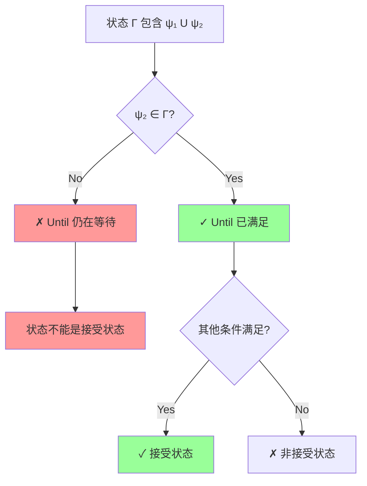

# [30] fix: correct accepting state condition for Until formulas

**Commit**: `97e2f8f` ([`97e2f8f26545b124f30e11a6654cef2bc009d8c0`](https://github.com/anthropics/cosy-zero/commit/97e2f8f26545b124f30e11a6654cef2bc009d8c0))
**Date**: 2026-01-02 09:46:22 +0800
**Author**: licoded <busy.li@foxmail.com>

## Description

Issue: is_accepting() was not properly checking that all Until
formulas have their right side satisfied.

Previous logic:
  if (right not in Γ AND left not in Γ) → false

Correct logic:
  if (right not in Γ) → false (regardless of left)

Reasoning:
  In LTLf, ψ1 U ψ2 means "ψ1 holds until ψ2 becomes true, AND
  ψ2 must eventually become true". If the trajectory ends
  with ψ1 U ψ2 still in state but ψ2 not satisfied, the
  Until is incomplete and the state cannot be accepting.

Also updated documentation to clarify the three accepting conditions:
1. false ∉ Γ
2. Γ is locally consistent
3. All Until formulas have right side satisfied

🤖 Generated with [Claude Code](https://claude.com/claude-code)

Co-Authored-By: Claude Opus 4.5 <noreply@anthropic.com>

## Changes

### Modified
- `migrationDocs/on_the_fly_synthesis/TABLEAU_DFA.md`
- `src/automata/tableau.cpp`


## AI Analysis

### 📝 Change Summary
修复了 LTLf synthesis 中 Until 公式的接受状态判定逻辑。旧代码错误地允许 "等待中" 的 Until 公式使状态成为接受状态，这违反了 LTLf 的语义 —— `ψ₁ U ψ₂` 要求 ψ₂ 必须在有限轨迹内最终为真。

### 🔍 Technical Details

**LTLf Until 语义** (`ψ₁ U ψ₂`):
- ψ₁ 持续为真，**直到** ψ₂ 为真
- **ψ₂ 必须最终为真**（有限轨迹的关键要求）

**Bug 逻辑**:
```cpp
// 错误: 只要 left 或 right 任意一个在状态中就通过
if (formulas_.count(right) == 0 && formulas_.count(left) == 0) {
    return false;
}
```

**修复后**:
```cpp
// 正确: Until 仍在状态中时，right 必须已满足
if (formulas_.count(right) == 0) {
    return false;  // Until 仍在等待 right
}
```

### 📊 Impact Analysis


**范围**: `src/automata/tableau.cpp::TableauState::is_accepting()`
**影响**: DFA 构造的正确性，直接影响 synthesis 结果的可靠性

### ⚠️ Notes
- 此 bug 会导致某些 non-realizable 公式被错误判定为 realizable
- 同步更新了 `TABLEAU_DFA.md` 文档，明确三条接受状态条件

## Stats

- **2** files changed
- **13** insertions(+)
- **14** deletions(-)
