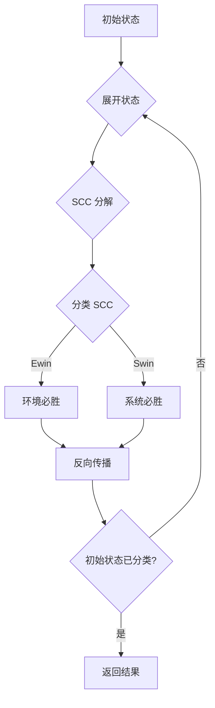

# [38] feat: implement on-the-fly game solver

**Commit**: `0589137` ([`058913734dfa9bf1bf46b1dc38c7b623364dcb4f`](https://github.com/licoded/CosyZeroRewrite/commit/058913734dfa9bf1bf46b1dc38c7b623364dcb4f))
**Date**: 2026-01-02 09:13:57 +0800
**Author**: licoded <busy.li@foxmail.com>

## Description

Implement the on-the-fly game solving algorithm (Algorithm 2 from
arXiv:2408.07324) with SCC decomposition and state classification.

- GameState: Game state with DFA state, player, and output assignment
- OnTheFlyGameSolver: Main solver with lazy state expansion
- Tarjan's algorithm: SCC decomposition on-the-fly
- State classification: Swin/Ewin based on accepting DFA states
- Backward propagation: Classify predecessors from SCCs

Key features:
- Early termination when initial state classified
- Lazy state expansion (only when needed)
- Proper SCC classification rules
- Backward propagation for both system and environment states

🤖 Generated with [Claude Code](https://claude.com/claude-code)

Co-Authored-By: Claude Opus 4.5 <noreply@anthropic.com>

## AI Analysis

### 📝 Change Summary
实现 on-the-fly 游戏求解算法（arXiv:2408.07324 Algorithm 2）。结合 **Tarjan SCC 算法**和**状态分类**，判定 LTLf 公式是否可实现。关键创新是按需展开状态，初始状态一旦被分类即可终止。

### 🔍 Technical Details

**游戏状态**：
```cpp
GameState = (DFA状态, 玩家, 输出赋值)
// 玩家: System (S) 或 Environment (E)
```

**求解流程**：


**SCC 分类规则**（基于 Parity 逻辑）：
- **Swin**: 系统可强制到达接受状态
- **Ewin**: 环境可避免到达接受状态

### 📊 Impact Analysis
- **范围**: `include/synthesis/`, `src/synthesis/`
- **影响**: 实现 `is_realizable()` 函数，完整的 LTLf Synthesis 流程
- **性能**: On-the-fly 展开避免构造完整游戏图

## Changes

### Added
- `include/synthesis/game_solver.hpp`
- `include/synthesis/on_the_fly_solver.hpp`
- `include/synthesis/synthesis.hpp`
- `src/synthesis/game_solver.cpp`
- `src/synthesis/on_the_fly_solver.cpp`
- `src/synthesis/synthesis.cpp`

## Stats

- **6** files changed
- **1455** insertions(+)
- **0** deletions(-)
