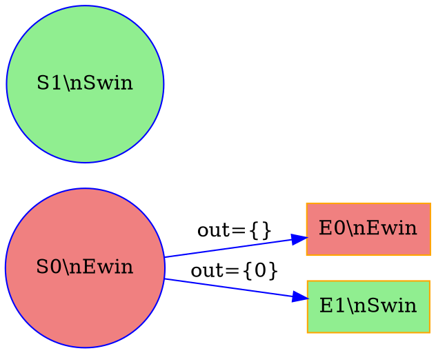

# Trace Visualization System 设计文档

> 设计日期: 2026-01-04
> 状态: 设计阶段

---

## 1. 概述

### 1.1 目标

创建一个基于 Web 的可视化系统，用于展示 LTLf Synthesis 代码执行过程。系统将：

1. **显示主要执行步骤** (Stages):
   - Expand (状态扩展)
   - SCC (强连通分量检测)
   - Fixed-point iteration (不动点迭代)

2. **显示每个步骤的子步骤** (Sub-steps):
   - Expand: 每个新状态的扩展
   - SCC: 每个 SCC 的发现过程
   - Fixed-point: 每次迭代的 Swin/Ewin 状态变化

3. **高亮显示变化**:
   - 新增的节点和边
   - SCC 节点
   - 待处理节点

### 1.2 架构

```
┌─────────────────────────────────────────────────────────────┐
│                     C++ Synthesis Engine                    │
│  ┌─────────────────────────────────────────────────────┐   │
│  │              TraceExporter (新增)                    │   │
│  │  - 记录每个步骤的状态                                 │   │
│  │  - 生成 JSON trace 数据                             │   │
│  │  - 输出到 results/trace_{timestamp}/                 │   │
│  └─────────────────────────────────────────────────────┘   │
└─────────────────────────────────────────────────────────────┘
                              │
                              ▼
┌─────────────────────────────────────────────────────────────┐
│                    JSON Trace File                          │
│  results/trace_{timestamp}/HH-period/formula_id/trace.json  │
└─────────────────────────────────────────────────────────────┘
                              │
                              ▼
┌─────────────────────────────────────────────────────────────┐
│                   Web Visualizer (前端)                      │
│  ┌─────────────────┐  ┌─────────────────┐  ┌─────────────┐ │
│  │  Left Sidebar   │  │   Main Canvas   │  │  Controls   │ │
│  │  (Step Tree)    │  │   (Graph DOT)   │  │  (Stepper)  │ │
│  └─────────────────┘  └─────────────────┘  └─────────────┘ │
└─────────────────────────────────────────────────────────────┘
```

---

## 2. JSON Schema 设计

### 2.1 整体结构

```json
{
  "formula": "原始 LTLf 公式字符串",
  "timestamp": "生成时间戳",
  "stages": [
    {
      "stage_id": "stage_001",
      "stage_type": "expand|scc|fixed_point",
      "description": "阶段描述",
      "sub_steps": [
        {
          "step_id": "step_001",
          "description": "步骤描述",
          "graph_data": {
            "dot": "完整的 DOT 字符串",
            "num_nodes": 10,
            "num_edges": 15
          },
          "highlights": {
            "new_nodes": ["S0", "E0"],
            "new_edges": [
              {"from": "S0", "to": "E0", "label": "out={}"}
            ],
            "scc_nodes": ["S1", "E1"],
            "pending_nodes": ["S2"]
          },
          "state_info": {
            "swin_count": 3,
            "ewin_count": 2,
            "unknown_count": 1
          }
        }
      ]
    }
  ],
  "summary": {
    "total_steps": 42,
    "total_states": 10,
    "realizable": true
  }
}
```

### 2.2 字段说明

| 字段 | 类型 | 说明 |
|------|------|------|
| `formula` | string | 原始 LTLf 公式 |
| `timestamp` | string | ISO 8601 时间戳 |
| `stages` | array | 执行阶段列表 |
| `stage_type` | enum | `expand`, `scc`, `fixed_point` |
| `graph_data.dot` | string | **完整** DOT 字符串 (方案 A) |
| `highlights.new_nodes` | array[string] | 本步骤新增的节点 ID |
| `highlights.new_edges` | array[object] | 本步骤新增的边 |
| `highlights.scc_nodes` | array[string] | 当前 SCC 的节点 |
| `highlights.pending_nodes` | array[string] | 待处理节点 |

---

## 3. 高亮规则

### 3.1 多层高亮方案

```
优先级从高到低:

┌─────────────────────────────────────────────────────────┐
│ Layer 1: 节点类型 (基础)                                  │
│ ├── System 状态: 圆形 (蓝色边框)                         │
│ └── Environment 状态: 方形 (橙色边框)                    │
├─────────────────────────────────────────────────────────┤
│ Layer 2: 胜利区域 (语义)                                  │
│ ├── Swin: 浅绿色填充                                     │
│ └── Ewin: 浅红色填充                                     │
├─────────────────────────────────────────────────────────┤
│ Layer 3: 执行变化 (动态)                                  │
│ ├── 新节点: 蓝色发光边框 (box-shadow)                    │
│ ├── 新边: 蓝色加粗线条                                   │
│ ├── SCC 节点: 黄色高亮边框                               │
│ └── 待处理节点: 灰色半透明覆盖                            │
└─────────────────────────────────────────────────────────┘
```

### 3.2 颜色方案

| 元素 | 颜色 | CSS |
|------|------|-----|
| Swin 填充 | 浅绿 | `#90EE90` / `lightgreen` |
| Ewin 填充 | 浅红 | `#F08080` / `lightcoral` |
| 新节点高亮 | 蓝色发光 | `box-shadow: 0 0 10px #2196F3` |
| SCC 节点 | 黄色 | `stroke: #FFD700; stroke-width: 3` |
| 待处理节点 | 灰色覆盖 | `fill-opacity: 0.5` |
| 新边 | 蓝色加粗 | `stroke: #2196F3; stroke-width: 3` |

---

## 4. 输出位置

### 4.1 目录结构

```
results/
└── trace_{timestamp}/          # timestamp: YYYYMMDD_HHMMSS
    ├── 01-morning/             # 06-12
    ├── 02-afternoon/           # 12-18
    ├── 03-evening/             # 18-24
    └── 04-night/               # 00-06
        └── {formula_id}/       # 基于公式 hash
            ├── trace.json      # 主 trace 文件
            └── summary.html    # 可选: 快速预览
```

### 4.2 增量写入策略

```cpp
// 伪代码
class TraceExporter {
    std::ofstream json_file_;

    void begin_stage(const std::string& type) {
        // 写入 stage 开始标记
    }

    void add_sub_step(const SubStep& step) {
        // 增量写入 sub_step
        json_file_ << step.to_json();
    }

    void end_stage() {
        // 关闭 stage
    }
};
```

---

## 5. 前端设计

### 5.1 布局

```
┌─────────────────────────────────────────────────────────┐
│  Header: LTLf Synthesis Trace Visualizer                 │
├──────────────┬──────────────────────────────────────────┤
│              │                                           │
│  Step Tree   │           Graph Canvas                    │
│              │          (DOT SVG Renderer)               │
│  ▼ Stage 1   │                                           │
│    ▶ Step 1  │                                           │
│    ▶ Step 2  │                                           │
│  ▼ Stage 2   │                                           │
│    ▶ Step 3  │                                           │
│              │                                           │
├──────────────┴──────────────────────────────────────────┤
│  Controls:  [< Prev] [Next >] | Step: 3 / 42 | [Auto]   │
└─────────────────────────────────────────────────────────┘
```

### 5.2 技术栈

- **框架**: Vite + Vue 3 + TypeScript
- **Graphviz 渲染**: viz.js (WebAssembly)
- **UI 组件**: Element Plus / shadcn-vue
- **状态管理**: Pinia (如需)

---

## 6. 实现计划

### Phase 1: C++ Trace Exporter
- [ ] 创建 `src/synthesis/trace_exporter.hpp/cpp`
- [ ] 定义 JSON 输出结构
- [ ] 在 OnTheFlyGameSolver 中集成 trace 点
- [ ] 实现增量 JSON 写入

### Phase 2: 前端基础
- [ ] 初始化 Vite + Vue 3 项目
- [ ] 实现基本布局 (Sidebar + Canvas + Controls)
- [ ] 集成 viz.js 进行 DOT 渲染

### Phase 3: 交互功能
- [ ] Step Tree 组件 (展开/折叠)
- [ ] Stepper 控制器 (前进/后退/自动播放)
- [ ] 高亮显示逻辑

### Phase 4: 优化与集成
- [ ] 性能优化 (大规模图)
- [ ] 与主程序集成 (命令行开关)
- [ ] 文档和测试

---

## 7. 设计决策记录

### Q1: DOT 存储方式
**决策**: 存储完整 DOT 字符串 (方案 A)

**理由**:
- 简单直接，易于调试
- 每个步骤独立，无需解析增量变化
- 存储空间在可接受范围内 (通常 < 10MB)

### Q2: 高亮方案
**决策**: 多层高亮 + SVG DOM 操作

**理由**:
- 层次清晰，易于理解
- SVG DOM 操作灵活，易于实现动画效果

### Q3: JSON 写入策略
**决策**: 增量写入 + 单文件

**理由**:
- 避免内存中累积大量数据
- 程序崩溃时也能保留部分 trace
- 单文件易于传输和查看

### Q4: 前端框架
**决策**: Vite + Vue 3 + TypeScript

**理由**:
- Vite 提供快速开发体验
- Vue 3 Composition API 适合状态管理
- TypeScript 提供类型安全

### Q5: 导航方式
**决策**: 左侧树形导航 + 底部步进器结合

**理由**:
- 树形结构展示整体流程
- 步进器方便顺序查看
- 两者联动，提供最佳体验

---

## 8. 附录

### 8.1 DOT 格式示例



### 8.2 参考资源

- **Graphviz DOT 文档**: https://graphviz.org/doc/info/lang.html
- **viz.js**: https://github.com/mdaines/viz.js
- **Vite**: https://vitejs.dev/
- **Vue 3**: https://vuejs.org/
