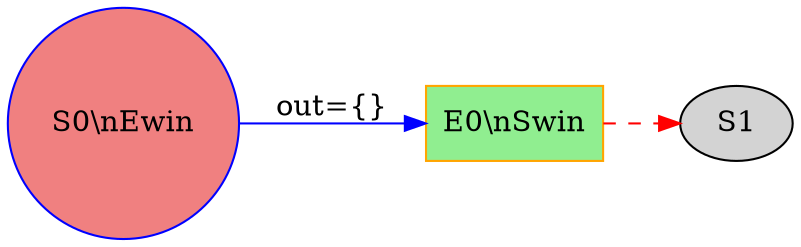

# Trace JSON Schema 详细规范

> 版本: 1.0
> 日期: 2026-01-04

---

## 1. 根对象 (Root Object)

```json
{
  "$schema": "http://json-schema.org/draft-07/schema#",
  "title": "LTLf Synthesis Trace",
  "type": "object",
  "required": ["formula", "timestamp", "stages"],
  "properties": {
    "formula": {
      "type": "string",
      "description": "原始 LTLf 公式字符串"
    },
    "timestamp": {
      "type": "string",
      "format": "date-time",
      "description": "ISO 8601 格式的时间戳"
    },
    "formula_id": {
      "type": "string",
      "description": "公式的唯一标识 (hash 或 uuid)"
    },
    "config": {
      "$ref": "#/definitions/config"
    },
    "stages": {
      "type": "array",
      "items": { "$ref": "#/definitions/stage" }
    },
    "summary": {
      "$ref": "#/definitions/summary"
    }
  }
}
```

---

## 2. Stage (执行阶段)

```json
{
  "definitions": {
    "stage": {
      "type": "object",
      "required": ["stage_id", "stage_type", "sub_steps"],
      "properties": {
        "stage_id": {
          "type": "string",
          "pattern": "^stage_[0-9]{3}$"
        },
        "stage_type": {
          "type": "string",
          "enum": ["expand", "scc", "fixed_point", "attractor"]
        },
        "description": {
          "type": "string",
          "description": "阶段的人类可读描述"
        },
        "sub_steps": {
          "type": "array",
          "items": { "$ref": "#/definitions/sub_step" }
        }
      }
    }
  }
}
```

### Stage Type 说明

| stage_type | 说明 | 典型 sub_steps |
|------------|------|----------------|
| `expand` | 状态扩展阶段 | 每个新状态的扩展 |
| `scc` | SCC 检测阶段 | 每个 SCC 的发现 |
| `fixed_point` | 不动点迭代 | 每次迭代的 Swin/Ewin 变化 |
| `attractor` | 吸引子计算 | 吸引子集的逐步构建 |

---

## 3. Sub-Step (子步骤)

```json
{
  "definitions": {
    "sub_step": {
      "type": "object",
      "required": ["step_id", "graph_data"],
      "properties": {
        "step_id": {
          "type": "string",
          "pattern": "^step_[0-9]{3}$"
        },
        "description": {
          "type": "string"
        },
        "graph_data": {
          "$ref": "#/definitions/graph_data"
        },
        "highlights": {
          "$ref": "#/definitions/highlights"
        },
        "state_info": {
          "$ref": "#/definitions/state_info"
        },
        "metrics": {
          "$ref": "#/definitions/metrics"
        }
      }
    }
  }
}
```

---

## 4. Graph Data (图数据)

```json
{
  "definitions": {
    "graph_data": {
      "type": "object",
      "required": ["dot"],
      "properties": {
        "dot": {
          "type": "string",
          "description": "完整的 Graphviz DOT 字符串"
        },
        "format": {
          "type": "string",
          "enum": ["dot"],
          "description": "图格式类型，当前只支持 dot"
        },
        "num_nodes": {
          "type": "integer",
          "minimum": 0
        },
        "num_edges": {
          "type": "integer",
          "minimum": 0
        }
      }
    }
  }
}
```

### DOT 格式要求

DOT 字符串必须遵循以下规范：



**关键属性**:
- System 状态: `shape=circle`, `color=blue`
- Environment 状态: `shape=box`, `color=orange`
- Swin: `fillcolor=lightgreen`
- Ewin: `fillcolor=lightcoral`

---

## 5. Highlights (高亮信息)

```json
{
  "definitions": {
    "highlights": {
      "type": "object",
      "properties": {
        "new_nodes": {
          "type": "array",
          "items": { "type": "string" },
          "description": "本步骤新增的节点 ID 列表"
        },
        "new_edges": {
          "type": "array",
          "items": { "$ref": "#/definitions/edge" },
          "description": "本步骤新增的边"
        },
        "updated_nodes": {
          "type": "array",
          "items": {
            "type": "object",
            "properties": {
              "id": { "type": "string" },
              "changes": { "type": "string" }
            }
          },
          "description": "状态发生变化的节点"
        },
        "scc_nodes": {
          "type": "array",
          "items": { "type": "string" },
          "description": "当前 SCC 中的节点"
        },
        "scc_id": {
          "type": "string",
          "description": "SCC 标识符"
        },
        "pending_nodes": {
          "type": "array",
          "items": { "type": "string" },
          "description": "待处理的节点"
        },
        "attractor_nodes": {
          "type": "array",
          "items": { "type": "string" },
          "description": "吸引子集中的节点"
        }
      }
    }
  }
}
```

### Edge 对象

```json
{
  "definitions": {
    "edge": {
      "type": "object",
      "required": ["from", "to"],
      "properties": {
        "from": { "type": "string" },
        "to": { "type": "string" },
        "label": { "type": "string" },
        "type": {
          "type": "string",
          "enum": ["sys_move", "env_move"]
        }
      }
    }
  }
}
```

---

## 6. State Info (状态信息)

```json
{
  "definitions": {
    "state_info": {
      "type": "object",
      "properties": {
        "swin_count": {
          "type": "integer",
          "minimum": 0
        },
        "ewin_count": {
          "type": "integer",
          "minimum": 0
        },
        "unknown_count": {
          "type": "integer",
          "minimum": 0
        },
        "total_states": {
          "type": "integer",
          "minimum": 0
        },
        "current_scc": {
          "type": "integer",
          "description": "当前 SCC 索引"
        }
      }
    }
  }
}
```

---

## 7. Metrics (性能指标)

```json
{
  "definitions": {
    "metrics": {
      "type": "object",
      "properties": {
        "duration_ms": {
          "type": "number",
          "description": "本步骤耗时 (毫秒)"
        },
        "memory_kb": {
          "type": "number",
          "description": "内存使用 (KB)"
        }
      }
    }
  }
}
```

---

## 8. Summary (总结)

```json
{
  "definitions": {
    "summary": {
      "type": "object",
      "properties": {
        "total_steps": {
          "type": "integer"
        },
        "total_states": {
          "type": "integer"
        },
        "total_sccs": {
          "type": "integer"
        },
        "realizable": {
          "type": "boolean"
        },
        "duration_ms": {
          "type": "number"
        },
        "stages_summary": {
          "type": "array",
          "items": {
            "type": "object",
            "properties": {
              "stage_type": { "type": "string" },
              "steps_count": { "type": "integer" }
            }
          }
        }
      }
    }
  }
}
```

---

## 9. 完整示例

```json
{
  "formula": "(true U p)",
  "timestamp": "2026-01-04T12:00:00Z",
  "formula_id": "abc123",
  "config": {
    "algorithm": "on_the_fly",
    "partition": { "inputs": [], "outputs": ["p"] }
  },
  "stages": [
    {
      "stage_id": "stage_000",
      "stage_type": "expand",
      "description": "Initial state expansion",
      "sub_steps": [
        {
          "step_id": "step_000",
          "description": "Create initial state S0",
          "graph_data": {
            "dot": "digraph GameGraph { ... }",
            "num_nodes": 1,
            "num_edges": 0
          },
          "highlights": {
            "new_nodes": ["S0"]
          },
          "state_info": {
            "total_states": 1,
            "swin_count": 0,
            "ewin_count": 0,
            "unknown_count": 1
          }
        }
      ]
    },
    {
      "stage_id": "stage_001",
      "stage_type": "scc",
      "description": "SCC detection",
      "sub_steps": [
        {
          "step_id": "step_001",
          "description": "Found SCC #0",
          "graph_data": {
            "dot": "digraph GameGraph { ... }",
            "num_nodes": 6,
            "num_edges": 8
          },
          "highlights": {
            "scc_nodes": ["S1", "E1", "S2"],
            "scc_id": "scc_0"
          }
        }
      ]
    },
    {
      "stage_id": "stage_002",
      "stage_type": "fixed_point",
      "description": "Fixed-point iteration for Swin/Ewin",
      "sub_steps": [
        {
          "step_id": "step_002",
          "description": "Iteration 1: Initialize",
          "graph_data": {
            "dot": "digraph GameGraph { ... }"
          },
          "state_info": {
            "swin_count": 3,
            "ewin_count": 3,
            "unknown_count": 0
          }
        }
      ]
    }
  ],
  "summary": {
    "total_steps": 3,
    "total_states": 6,
    "total_sccs": 2,
    "realizable": true,
    "duration_ms": 42.5,
    "stages_summary": [
      { "stage_type": "expand", "steps_count": 1 },
      { "stage_type": "scc", "steps_count": 1 },
      { "stage_type": "fixed_point", "steps_count": 1 }
    ]
  }
}
```

---

## 10. 前端解析示例 (TypeScript)

```typescript
interface Edge {
  from: string;
  to: string;
  label?: string;
  type?: 'sys_move' | 'env_move';
}

interface Highlights {
  new_nodes?: string[];
  new_edges?: Edge[];
  updated_nodes?: Array<{ id: string; changes: string }>;
  scc_nodes?: string[];
  scc_id?: string;
  pending_nodes?: string[];
  attractor_nodes?: string[];
}

interface GraphData {
  dot: string;
  format?: 'dot';
  num_nodes?: number;
  num_edges?: number;
}

interface StateInfo {
  swin_count: number;
  ewin_count: number;
  unknown_count: number;
  total_states?: number;
  current_scc?: number;
}

interface Metrics {
  duration_ms?: number;
  memory_kb?: number;
}

interface SubStep {
  step_id: string;
  description?: string;
  graph_data: GraphData;
  highlights?: Highlights;
  state_info?: StateInfo;
  metrics?: Metrics;
}

interface Stage {
  stage_id: string;
  stage_type: 'expand' | 'scc' | 'fixed_point' | 'attractor';
  description?: string;
  sub_steps: SubStep[];
}

interface Config {
  algorithm: string;
  partition: {
    inputs: string[];
    outputs: string[];
  };
}

interface Trace {
  formula: string;
  timestamp: string;
  formula_id?: string;
  config?: Config;
  stages: Stage[];
  summary?: {
    total_steps: number;
    total_states: number;
    total_sccs?: number;
    realizable: boolean;
    duration_ms?: number;
    stages_summary?: Array<{ stage_type: string; steps_count: number }>;
  };
}
```
