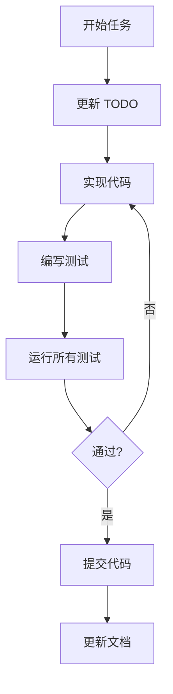

# 工作流程

> 开发过程中的标准操作流程

## 目录

| 流程 | 说明 |
|------|------|
| [Bug 修复流程](./bug_fix.md) | 从发现到修复的完整流程 |
| [TODO 管理](./todo_management.md) | 任务创建、跟踪、完成 |
| [提交规范](./commit_practice.md) | Git 提交消息格式和检查清单 |
| [测试策略](./testing_strategy.md) | 测试分层和覆盖率目标 |

## 快速参考

