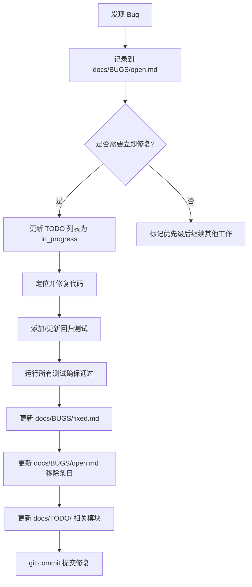

# Bug 修复流程

> 从发现到修复的完整标准流程

---

## 流程图



---

## 1. 发现 Bug

### 1.1 记录格式

在 `docs/BUGS/open.md` 中添加：

```markdown
## [Bug #XXX] 简短标题

**发现日期**: YYYY-MM-DD
**优先级**: 🔴高 / 🟡中 / 🟢低
**状态**: 已确认 / 待确认

**位置**: `文件路径:行号范围`

**问题描述**:
[详细描述问题的现象和根本原因]

**影响范围**:
- 受影响的组件/功能
- 用户场景

**复现步骤**:
```bash
# 最小复现用例
```

**临时解决方案** (如果存在):
[描述绕过问题的方法]

**修复方案**:
[描述计划如何修复，或指向相关设计文档]

**相关文件**:
- 受影响的代码文件
- 相关测试文件
```

### 1.2 优先级判断

| 优先级 | 标准 | 示例 |
|--------|------|------|
| 🔴 高 | 阻塞性问题，影响核心功能 | 解析器崩溃、合成结果错误 |
| 🟡 中 | 重要但不紧急，有 workaround | 变量名限制、错误消息不清晰 |
| 🟢 低 | 改进项，不影响功能 | 日志格式、性能优化 |

---

## 2. 修复 Bug

### 2.1 修复前

1. **理解问题**: 阅读相关代码和设计文档
2. **复现问题**: 编写最小复现用例
3. **设计修复**: 考虑边界情况和副作用

### 2.2 修复中

1. **编写回归测试**: 先写测试，确保修复前失败
2. **实现修复**: 遵循最小改动原则
3. **本地验证**: 运行相关测试

### 2.3 修复后

1. **运行全部测试**: 确保无回归
2. **添加注释**: 在代码中解释关键逻辑
3. **更新文档**: API 文档、注释

---

## 3. 记录修复

在 `docs/BUGS/fixed.md` 中添加：

```markdown
## [Bug #XXX] 简短标题

**发现日期**: YYYY-MM-DD
**修复日期**: YYYY-MM-DD
**影响版本**: vX.X
**优先级**: 🟡中

**问题描述**:
[简述问题，1-2 句话]

**修复方案**:
[描述修复方法，可包含关键代码片段]

**回归测试**:
- 新增测试用例名称
- 测试文件位置

**相关提交**: commit_hash - commit message
```

---

## 4. 示例：Bug #002 修复

### 问题描述
变量名以 `r`/`f`/`g` 开头被错误解析为操作符：
```
req → R + eq  (错误)
```

### 修复方案
添加 peek-ahead 逻辑：

```cpp
// 检查是否为多字符标识符
if ((c == 'R' || c == 'r') && i + 1 < input.size() &&
    std::isalpha(input[i + 1])) {
    // 标识符处理
} else {
    token.type = TokenType::Release;
}
```

### 回归测试
```cpp
TEST_CASE("Parser: Bug #002 - Variables starting with 'r'", "[regression]") {
    Formula* f = parser.parse("req");
    REQUIRE(f->is_literal());
    REQUIRE(pool.has_variable("req"));
}
```

### 结果
- 测试: 124 → 171 断言 (+47)
- 状态: 全部通过
